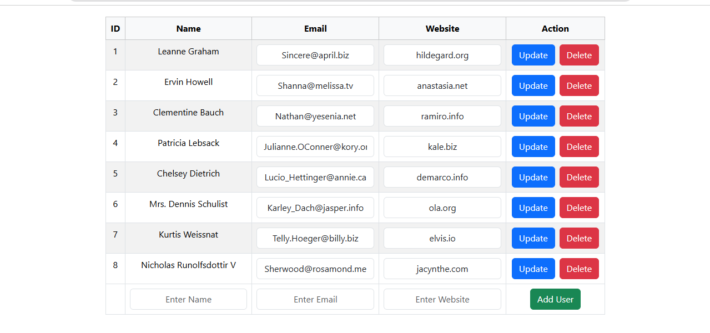
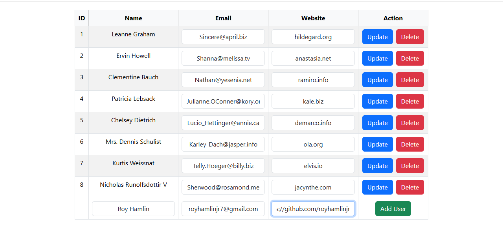
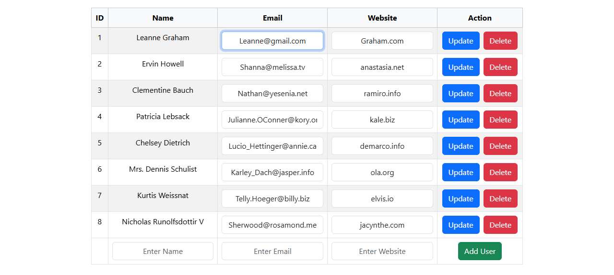
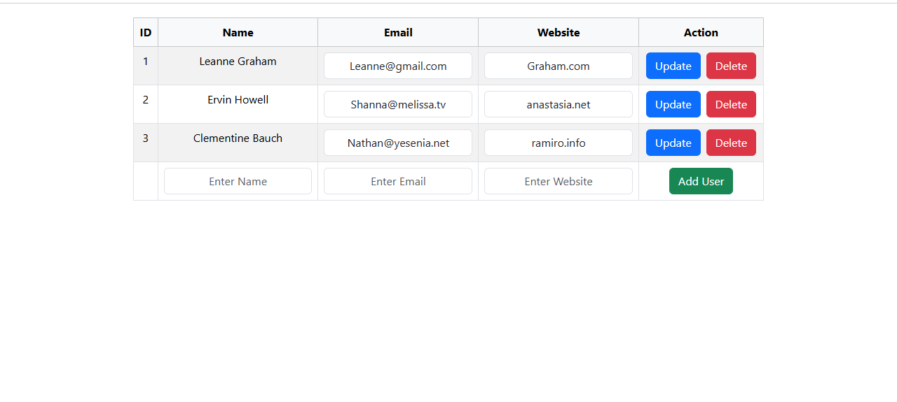

# API CRUD Project (React)

A clean and beginner-friendly **React CRUD application** that demonstrates how to perform **Create, Read, Update, and Delete** operations by integrating a public REST API.

The project uses the **JSONPlaceholder API** to simulate backend operations and focuses on frontend API handling using modern React practices.

---

## 🔍 Project Overview

- Displays user data in a structured table
- Allows adding, editing, and deleting users
- Uses REST API calls to simulate backend interaction
- Built using React Hooks and reusable components

---

## 🚀 Key Features

- REST API integration using `fetch()`
- Full CRUD functionality (Create, Read, Update, Delete)
- State management with `useState` and `useEffect`
- Editable table-based UI
- Responsive layout using Bootstrap
- Clean and readable codebase

---

## 🛠️ Tech Stack

<p align="left">
  
</p>

- **React JS**
- **JavaScript (ES6+)**
- **HTML5**
- **CSS3**
- **Bootstrap**
- **JSONPlaceholder REST API**

---

## 📂 Project Structure

```
API_CRUD_Project/
├── screenshots/                  # All screenshots
│   ├── main-page.png
│   ├── add-user.png
│   ├── edit-user.png
│   └── delete-user.png
│
├── public/
│   └── index.html
│
├── src/
│   ├── App.js              # Main React component
│   ├── App.css             # Component styles
│   ├── index.js            # React entry point
│   ├── index.css           # Global styles
│   ├── App.test.js         # Test configuration
│   ├── reportWebVitals.js  # Performance metrics
│   └── setupTests.js       # Testing setup
│
├── package.json
└── README.md
```

---

## ▶️ Run Locally

# Clone the repository
git clone https://github.com/royhamlinjr/API_CRUD_Project.git

# Navigate to the project directory
cd API_CRUD_Project

# Install dependencies
npm install

# Start the development server
npm start

# The application will be available at:
http://localhost:3000

---

## 📸 Screenshots

### 1. Home Page
Displays all users fetched from the API in a clean table.


### 2. Add User
Form to create a new user.


### 3. Update User
Edit an existing user’s details.


### 4. Delete User
Delete a user from the table.



That’s it. Nothing more.

---


